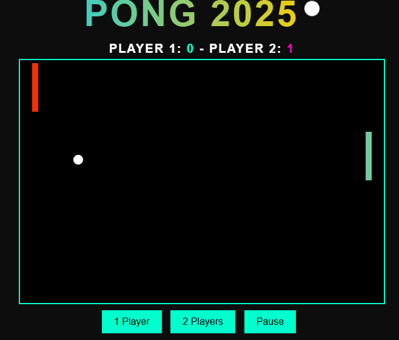

<h1 style="color: red; display: inline;">P</h1>
<h1 style="color: orange; display: inline;">O</h1>
<h1 style="color: yellow; display: inline;">N</h1>
<h1 style="color: green; display: inline;">G</h1>
<h1 style="color: blue; display: inline;"> </h1>
<h1 style="color: purple; display: inline;">2</h1>
<h1 style="color: pink; display: inline;">0</h1>
<h1 style="color: brown; display: inline;">2</h1>
<h1 style="color: cyan; display: inline;">5</h1>

Este es un proyecto de un juego de <strong>Pong</strong> desarrollado como parte del <strong>Curso de JS Creativo</strong> de <strong>Aiko Academy</strong>. El juego es una recreación moderna del clásico Pong, donde los jugadores controlan palas para golpear una pelota de un lado al otro de la pantalla.

## Descripción

Pong 2025 es una versión mejorada y moderna del clásico Pong, implementado en JavaScript. Los jugadores pueden jugar en modo de un solo jugador o de dos jugadores, controlando las palas con las teclas de dirección o con el mouse.

## Tecnologías utilizadas

<ul>
  <li><strong>HTML</strong></li>
  <li><strong>CSS</strong></li>
  <li><strong>JavaScript</strong> (Vanilla JS)</li>
  <li><strong>Audio</strong> para sonidos de interacciones (por ejemplo, sonido de la pelota rebotando)</li>
</ul>

## Instalación

Para jugar el juego localmente, sigue estos pasos:

<ol>
  <li>Clona este repositorio:</li>
  <pre><code>git clone https://github.com/lagabyok/Pong-2025-.git</code></pre>
  <li>Navega a la carpeta del proyecto:</li>
  <pre><code>cd Pong-2025-</code></pre>
  <li>Abre el archivo <code>index.html</code> en tu navegador para comenzar a jugar.</li>
</ol>

## 📸 Captura de pantalla

Aquí tienes una imagen del juego:

## Créditos

Este proyecto fue creado en el marco del <strong>Curso de JS Creativo</strong> de <strong>Aiko Academy</strong>. Agradezco a la academia y el profesor por la oportunidad de aprender y desarrollar este juego.

## Autor

<strong>Lagabyok</strong>Gabriela Coronel

